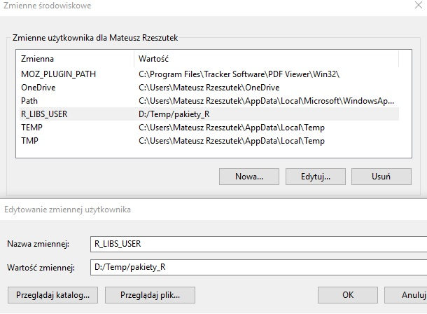

<style type="text/css"> body  { font-size: 14px; text-align: justify} code.r{ font-size: 14px;} pre   { font-size: 14px} 
h1    { font-size: 24px;} h2    { font-size: 22px;} h3    { font-size: 20px;} </style>

***

**Mateusz Rzeszutek** 

**AGH** Akademia Górniczo-Hutnicza im. Stanisława Staszica w Krakowie, Wydział Geodezji Górniczej i Inżynierii Środowiska, Katedra Kształtowania i Ochrony Środowiska

**e-mail:** *[rzeszut@agh.edu.pl](rzeszut@agh.edu.pl)*

**lokalizacja:**  bud. C-4, p. V, pok. 511, al. A. Mickiewicz 30, Kraków, Polska

**konsultacje:** Zgodnie z informacjami na stronie
[dziekantu](https://dziekanat.geod.agh.edu.pl/dziekanat/index.php?menu1=4&menu2=17&co=o&lin=o&wiad=@f_konsult_prez) lub po uzgodnieniu za pośrednictwem e-mail

Jeśli chcesz dowiedzieć się o mnie torchę więcej to odwiedźć moją stronę [WWW](http://home.agh.edu.pl/~rzeszut/).

Wyniki moich badań możecie śledzić za pośrednictwem tzw. facebooka dla naukowców czyli [researchgate](https://www.researchgate.net/profile/Mateusz_Rzeszutek)

***


***


```{r setup, include=FALSE}
knitr::opts_chunk$set(echo = TRUE, warning=F,message=F,error=F)
```


# 1. Wprowadzenie 

Praca z dużymi zbiorami danych może być bardzo frustrująca i czasochłonna. Gdyby tylko istniało narzędzie do upraszczania rzeczywistości bez konieczności inwestowania duzej ilości czasu, aby się go nauczyć ! Jestem tutaj, aby powiedzieć wam, że istnieje rozwiązanie. 

Jeśli pracujesz z technikami dostarczającymi dużych zbiorów danych, być może słyszałeś o języku programowania R [@RCoreTeam2018d]. Może masz nawet kilku kolegów, którzy go używają, ale powiedzieli ci, że jest to dość skomplikowane i jesteś zbyt przerażony, aby dać mu szansę. W ramach tego kursu postaram się wam udowodnić, że `R` jest prostym, przyjmenym oraz wygodnym narzędziem. Można zrobić w nim bardzo wiele rzeczy. Ograniczać może was jedynie wyobraźnia.


```{r, echo=F, out.height="80%", out.width= "80%", fig.align='center'}
knitr::include_graphics("https://bitesizebio.com/wp-content/uploads/2013/05/R-programming.jpg")
```


***

Z cyklu cytaty wielki postaci, mój nauczycie fizyki z liceum zwykł mawiać:


***

*Nie ma rzweczy nie możliwych. Są tylko mało prawdopodobne* --- Cornelia Funke

***

Materiał całego kursu został opracowany na podstawie kursów i książek, które są dostępnych online, tj.:

1. [Pogromcy danych](http://www.pogromcydanych.icm.edu.pl/). Kurs został opracowany w 2015 roku przez [Przemysława Biecka]([http://pbiecek.github.io/).
2. Data wrangling, exploration, and analysis with R, University of British Columbia, [stat545](http://stat545.com/).
3. Przemysław Biecek: [Przewodnik po pakiecie R 4.0](https://pbiecek.gitbooks.io/przewodnik/content/) [@biecek2008przewodnik].
4. Garrett Grolemund, Hadley Wickham: [R for Data Science](http://r4ds.had.co.nz/) [@Wickham:2017:RDS:3086927]

Należy róWnież wspomnieć o podręcznikach do nauki języka programowania R, które są dystrybuowane przez @RStudioTeam2015:

1. [An Introduction to R](https://cran.r-project.org/doc/manuals/r-release/R-intro.html),
2. [R Data Import/Export](https://cran.r-project.org/doc/manuals/r-release/R-data.html),
3. [R Installation and Administration](https://cran.r-project.org/doc/manuals/r-release/R-admin.html),
4. [Writing R Extensions](https://cran.r-project.org/doc/manuals/r-release/R-exts.html),
5. [The R language definition](https://cran.r-project.org/doc/manuals/r-release/R-lang.html),
6. [R Internals](https://cran.r-project.org/doc/manuals/r-release/R-ints.html),
7. [The R Reference Index](https://cran.r-project.org/doc/manuals/r-release/fullrefman.pdf).

Szczególnie poleceam polecam pozycję [@Wickham:2017:RDS:3086927], która została opracowana przez twórcóW mega-pakietu [tidyvers](https://www.tidyverse.org/). Jest to orginalna pozycja, która przedstawian inne, nietypowe podejście do nauki programowania w R. Wiecej o pakiecie `tidyverse` powiemy trochę póżniej.

W miarę postępu kursu będzie przybywać coraz więcej różnych materiałów źródłowych. Powyższe pozycje uważam jednak za fundamentalne i stanowią one ważny punkty odniesienia względem wiedzy i umiejętności, ktore zamierzam wam przekazać.

***

## 1.1. Dlaczego R

R jest językiem programowania stosowanym w analizie danych oraz wizualizacji danych. Między innymi szeroko rozumianych danych środowiskowych i przestrzennych, które są wzajemnie z sobą powiązane. Obecny rozwój technik pomiarowych, w tym satelitarnych przyczynił się do zwrostu ilości różnych baz danych przechowujących informacje o otaczajacej nas rzeczywistosci. Przez najbliższe 3.5 roku nauczycie sie bardzo wiele na ten temat różnego rodzaju danych, więc dobrze jest mieć narzędzie, które świetnie radzi sobie z ich obsługą.  

Ważna cechą R jest fakt, że jest dostępnym bezpłatnie na otwartej licencji GPL [@RCoreTeam2018d]. Nadaje się on świetnie do interaktywnej pracy z danymi, ponieważ połączono w nim wybrane cechy języków funkcyjnych oraz obiektowych. Posiada biblioteki tworzenie raportów z wynikami oraz ogromną ilość pakietów, które niejednokrotnie wam pomogą w rozwiazaniu niejednego problemu. Program ten jest chętnie stosowanych w małych firmach ze względu na koszty. Ponadto świetnie integruje się z innymi językami programowania np.: Python, Java, C, C++, czy z bazami danych np.: Postgres [@RCoreTeam2018f]. Dostępne są pakiety, które korzystają z możliwości JavaScript, np.: [htmlswidgets](https://www.rstudio.com/resources/webinars/creating-javascript-data-visualizations-in-r/).

Język programowania R:

* jest całkowicie bezpłatny, 
* jest to oprogramowanie typu open-source, dlatego jest ono stale sprawdzane i rozbudowywane przez użytkowników,
* jest bardzo przydatny w przypadku dużych ilości danych, ponieważ nie wymaga dużej mocy obliczeniowej komputera (próbowałeś kiedyś pracować z 200 000 wierszy w exelu, jak ci szło ?),
* Zapewnia wysoką jakość grafiki,
* ma dużą społeczność użytkowników, więc możesz łatwo uzyskać wsparcie online.

Istnieje wiele powodów dla których warto uczyć się języka programowania R. Natomiast by nie przedłużać odsyłam was do wielu interesujących artykułów. To tylko kilka pozycji, które miałem przyjemność przeczytać w wolnje chwili.

1. [R czy Python](https://www.bluemetrica.com/r-czy-python-jakiego-jezyka-uczyc-sie-w-2018-roku/)
2. [Popularność języka R](https://jaki-jezyk-programowania.pl/technologie/r/)
3. [Ranking IEEE Spectrum](https://spectrum.ieee.org/static/interactive-the-top-programming-languages-2018)
4. [Ile zarabiasz znając R](https://mamstartup.pl/programowanie/10713/top-10-jezykow-programowania-z-najwyzszymi-zarobkami-w-2017)
5. [Dlaczego R? Wady i zalety](https://www.infoworld.com/article/2940864/application-development/r-p5. rogramming-language-statistical-data-analysis.html)
6. [Dlaczego R, 4 powody dla których warto się uczyć](https://data-flair.training/blogs/why-learn-r/)
7. [Sześć powodów dla stosowania R w biznesie](https://www.r-bloggers.com/six-reasons-to-learn-r-for-business/)

***

## 1.2. Zakres przedmiotu

Przedmiot **Skryptowe przetwarzanie danych** ma charakter praktyczny, a jego celem jest miedzyinnymi dostarczenie umiejętności posługiwania się bardzo iniwersalnym narzędziem, z które będziecie często wykorzystywać na innnych przedmiotach. 

Pełny zakres przedmiotu znajdziesz na stronie [Sylabusa](https://syllabuskrk.agh.edu.pl/2018-2019/pl/magnesite/study_plans/stacjonarne-geoinformacja). W wielkim skrócie, w ramach tego przedmiotu nauczysz się:

* podstaw programowania w języku R, 
* efektywnej pracy z różnego typu danymi,
* poznasz metody wizualizacji danych, w tym interaktywne,
* dowiesz się gdzie i jak szukać pomocy, gdy nie znasz rozwiązania problemu.

***

## 1.3. Podstawowe wymagania

Zanim zaczniesz, sprawdź czy spełniasz kryteria:

* obsługa komputera i systemu operacyjnego Windows,
* znajomość podstawowych edytorów tekstu i arkuszy kalkulacyjnych,
* znajomość i zrozumienie podstawowych parametrów fizycznych,
* elemenetarne podstawty statatystyki,

Program R jest dedykowanm językiem i środowiskiem dla obliczeń statystycznych i grafiki. Natomiast niniejszy kurs nie dotyczy statystyki. Pojawią się naturalnie jej elementy, ale proszę nie zakładać, że po tym kursie będziesz umiał budować modele statystyczne.

***

# 2. Konfuguracja R i Rstudio 

## 2.1. W domu

Pierwszą rzeczą od której trzeba zacząć to instalacja i konfiguracja R. Jest to proste zadanie, ale z róznych powodów trochę je skomplikuje, ponieważ w przyszłości nie będziemy musieli wracać do tego punktu.

1. [Pobierz R](https://cran.r-project.org/index.html),
2. [Pobierz Rtools](https://cran.r-project.org/index.html),
3. [Pobierz Rstudio](https://www.rstudio.com/products/RStudio/)
3. [Pobierz jave](https://www.java.com/pl/download/),
4. [Pobierz ImageMagick](https://www.imagemagick.org/script/download.php),
5. [Pobierz Pandoc](https://github.com/jgm/pandoc/releases/tag/2.2.3.2),
6. [Pobierz MiKTeX](https://miktex.org/download).


Rozpoczęcie przygoty z `R` można zacząć tylko od instalacji pozycji pierwszej. W przypadku systemów windows zalecanym jest instalacja również `Rtools`. Jednak takie podejscie jest bardzo nieefktywne ze względu na komfort pracy. Związku z tym na zajęciach, jak i w domu zalecam wam korzystanie z nakładki `RStudio` [@RStudioTeam2015], o której powiem więcej trochę póżniej. Zapewne osoby, które przeczytał: [R czy Python](https://www.bluemetrica.com/r-czy-python-jakiego-jezyka-uczyc-sie-w-2018-roku/), już wiedzą dlaczego właśnie `Rstudio`.

Zasadniczo na tym etapie można zakończyć pracę i rozpocząć swoją przygodę z R. Natomiast wiele technologii stosowanych w `R` wymaga zainstalowania dodatkowego oprogramowania.

Wczytywanie danych w postaci pliku *.xls, .xlsx* wymaga zainstalowania `Java`. Tworzenie animacji z pakietem `ggplot2` wymaga programu `ImageMagic`, a eksport raportów do plików html, czy pdf wymga również dwóch dodatkowych programów są to `Pandoc` i `MiKTeX` W wolnej chwili zainstalujcie również te pozycje.

Więcej informacji na temat instalacji `R` znajdziesz w @RCoreTeam2018e.

***

*Nie łudź się, żę chodzą tylko na zajęcia nauczysz się R. W domu też trzeba pracować.*

***

*„Jest tylko jeden sposób nauki. Poprzez działanie.”* --- Paulo Coelho

***


## 2.2. W pracowni komputerowej WGGiIŚ

W pracowni komputerowej posiadasz już zainstalowane powyższe oprogramowanie. Natomiast w odróżnieniu od komputera domowego nie masz uprawnień administratora i nie możesz instalować dodatkowego oprogramowania na dysku `c:`. Język `R` wymaga instastalowania pakietóW w których zawarte są funkcje. W celu instalowania nowych pakietów musimy ustawić nową zmienną środowiskową, która wskaże gdzie mają być instalowane. 

* W `D:Temp` utwórz dwa folder o nazwie `pakiety_R`.
* Otwórz `panel sterowania` i wejdźć w `konta użytkowników`.
* W menu po lewej stronie kliknij na `Zmień moje zmienne środowiskowe`
* Kliknij `Nowa`
    * W Nazwa zmiennej wprowadźć: `R_LIBS_USERS`  
    * W Wartość zmiennej wprowadźć: `D:Temp/pakiety_R`
* Kliknij `OK`

```{r, fig.align='center', echo=F}

```

Teraz wszystkie `pakiety R` będą instalowane w wskazanym katalogu do którego jako użytkownik masz nieograniczony dostęp. 

***

> Uwaga jeśli taki katalog istnieje, to nie twórz nowego. Będziesz prawdopodobnie szczęśliwy posiadaczem kilku działających pakietów.

***

## 2.3. Zintegrowane Środowisko programistyczne dla R 

Jeżeli wykorzystujemy R do prostych obliczeń, nie tworzymy skomplikowanych funkcji i nie planujemy powtarzać zdefiniowanych analizy to komendy możemy wpisywać bezpośrednio w linii poleceń po znaku zachęty (>). Jak to pokazano na poniższym rysunku.

```{r, out.height="70%", out.width="70%", fig.align='center', echo=FALSE}
knitr::include_graphics("https://windows-cdn.softpedia.com/screenshots/R-for-Windows_7.png")
```

Jednak do bardziej profesjonalnych zastosowań niezbędnym jest korzystanie z edytora, który posiada szeroki wachlarz możliwości. Opis kilku edytorów pakietu R znajdziecie w [Przewodnik po pakiecie R 4.0](https://pbiecek.gitbooks.io/przewodnik/content/). Dodatkowo zalecam zapoznanie się z opinią  zawartą pod tym [linkiem](https://r-dir.com/blog/2013/01/list-of-r-editors.html), która w zwięzły sposób uwypukla wady i zalety kilku edytorów R. Proponuje również zainstalowanie prostego edytora tekstowego [Notepad++](https://notepad-plus-plus.org/), w którym również można tworzyć skrypty. Będzie on przydatny w trakcie wstępnego przeglądania oraz tworzenia danych przed importem do programu R.

**Integrated Development Environment (IDE) for R** - w skrócie nakładka, edytor kodu R itd... 

W ramach kursu pracować będziemy z nakładką `Rstudio`, która obecnie jest najlepszy rozwiązaniem, wyróżniającym się na tle konkurencji. Poniższy rysunek przedstawia interfejs edytora R [@RStudioTeam2015]. Umożliwia on między innymi korzystanie z wielu plików, projektów oraz posiada możliwość wyświetlania zdefiniowanych obiektów, zmiennych, danych tabelarycznych, czy rysunków. Ma wbudowany system inteligentnej składni poleceń języka programowania R. 

```{r, fig.align='center', echo=F}
knitr::include_graphics("http://www.sthda.com/sthda/RDoc/images/rstudio.png")
```

Przedstawiony na powyższym rysunku IDE skłąda się z 4 okien.

**Lewy górny róg:** to miejsce w którym pisze się instrukcje. Te instrukcje można zaznaczyć i wysłać do wykonania poleceniem **CTRL+Enter**. 

**Lewy dolny panel:** to konsola programu R, tutaj wyświetlane są instrukcje wprowadzone do R oraz ich wyniki.

**Prawy dolny panel:** przedstawia wykresy wyprodukowane przez instrukcje w R. W tym panelu jest też wyświetlana pomoc dla funkcji.

**Prawy górny panel:** pokazuje jakie obiekty znajdują się obecnie w pamięci R oraz jak są one duże. Klikając na wybrane obiekty możemy podejrzeć ich zawartość. Każdy wiersz to obiekt. Ale po pierwszym uruchomieniu to okno będzie puste, ponieważ nic jeszcze nie wczytaliśmy do pamięci.

Pełny opis funkcjonalności nakładki `RStudio` można  szybko przyswoić dzięki ściagawce z ang. [*cheet sheat*](https://www.rstudio.com/wp-content/uploads/2016/01/rstudio-IDE-cheatsheet.pdf). W ramach tego kursu często będę wracał do ściągawek, ponieważ na początku pracy z `R` są bradzo pomocne. Ja róWnież często z nich korzystałem i korzystam do dziś.

W ramach pierwszego ćwieczenia, wpisz w wyszukiwarce google hasło: *"RCRAN cheet sheat"*. I znajdź *cheet sheat* o nazwie *"Base R"*. Napewno się przyda w ramach kolejnej lekcji.

***

# 3. Projekt w RStudio

Najwyższy czas zacząć pracę z R. Otwórz program RStudio. Aby skonfigurować nowy projekt, kliknij menu rozwijane w prawym górnym rogu RStudio. Kreator projektu poprosi cię o utworzenie lub wskzanie nowego folderu. Utwórz nowy folder projektu np.: `Projekt_1`. Tam będą zapisywane wrzystkie informacje. W folderze pojawi się plik z rozszerzeniem `.Rproj`. Za pomocą tego pliku możesz odtworzyć projekt. 

Zanim rozpoczniemy pracę, utwórz nowy **r skrypt**. Opcjonalnie naciśjnij **CTRL+SHIFT+N**. Pojawi się nowe okno edytora, w którym będziemy pisać kod. Po utworzeniu skryptu zapisz go pod dowolną nazwą z rozszerzeniem `.R`.

***

## 3.1. Przestrzeń robocza

Podstawowym zadaniem jest zbadanie miejsca w którym się znajdujemy. Możemy to sprawdzić poniższym poleceniem:

```{r, eval=F}
getwd()
```

Po napisaniu polecenia w oknie konsoli, wystarczy nacisnąć **enter**. Natomiast aby uruchomić kod znjadujący się w oknie skryptu należy wcisnąć **CTR+ENTER**. W drugiej motodzie kursor musi znajdować się w lini pisanego kodu. Ewentualnie można zaznaczyć polecenie.

Powinień pojawić się komunikat o ścieżce dostępu do katalogu w którym zapisany jest projekt.

```{r, echo=F}
getwd()
```

Pozycje przesrzeni roboczej możemy zmienić, poprzez wpisanie w nawiasach i cudzysłowiu nowej ścieżki dostępu:

```{r, eval=F}
setwd("wpisz ścieżkę dostępu do katalogu")
```

***

## 3.2. Instalowanie pakietów

Wielu użytkowników myśli o R jako systemie statystycznym. Nie jest to sposób myślenia odbiegający od prawdy, gdy ograniczymy się do samego R. Natomiast R może być łatwo rozbudowany o liczne `pakiety`, które znacząco rozszerzają jego funkcjonalność. 

W rozdziale 3.1. poznaliscie pierwszą funckję. Funkcje te znajdują się w pakietach programu `R`. Listę wrzystkich pakietóW znajdziecie na stronie głównej [programu R](https://cran.r-project.org/).

W ramach programu R możemy korzystać tzw. wbudowanych funkcji, które znajdują się w pakietach podstawowych. Listę tych pakietów możesz sprawdzić w prawym dolnym oknie w zakładce **Packages**. Jedną z tych funkcji jest funkcja instalowania pakietów `install.packages()` zawarta w pakiecie `utils`. W celu korzystania z funkcji, które nie są wbudowane w program R trzeba zainstalować dodatkowy pakiet. Przykładowo poniższe polecenie spowoduje zainstalowanie nowego pakietu `gdata`. 

```{r, eval=FALSE}
install.packages("gdata")
```

Program R pobiera pakiet z repozytorium CRAN i go instaluje.

Pakiet został zainstalowany, ale nie jest aktywny. Zwiazku z tym musimy go jeszcze wczytać:

```{r, echo=F}
library(gdata)
```

Nie wszystkie pakiety wymagają instalacji i aktywowania. Istnieje grupa pakietów podstawowych które są od razu zainstalowane i nie wymagają aktywacji. np: `base, graphics, stats, utils`

Teraz możemy zacząć korzystać z funkcji pakietu `gdata`. Najpierw jednak sprawdzimy, jakie przykłądowe dane zostały zainstalowane z tym pakietem.

```{r}
data(package = "gdata")
data(MedUnits)
```

W lewy górnym oknie wyświetli się wyniki polecenia, wskazujący że w tym pakiecie dostępny jest zestaw danych `MedUnits`. Druga linijka kodu spowodowała, że obiekt `MedUnits` pojawił się w zmiennych globalnych. W zależności od pakietu może być kilka zestawów danych lub po prostu może ich nie być. Dane można podglądnąć poleceniem:

```{r}
View(MedUnits)
```

W lewy górnym oknie wyświetliła się tabela która jest obiektem, zmienną (data.frame) i jest to: *tabela konwersji między normą międzynarodową (SI) a amerykańskimi "konwencjonalnymi" jednostkami dla powszechnych pomiarów medycznych*.

#### Ćwiczenie 1.  {.tabset .tabset-pills}
##### Treść zadania
Proszę zainstalować i wczytać pakiet `tidyverse`. Będziemy z niego korzystać w trakcie rozdziałów dotyczących efektywnej pracy z danymi w R.

***
##### Rozwiązanie

```{r, eval=F}
install.packages("tidyverse")
library(tidyverse)
```

***
####

## 3.3. Instalowanie pakietów z innych repozytoriów

Nie wrzystkie pakiety są dostępne w repozytorium CRAN. Źródłem wielu pakietów jest repozytorium `GitHub`. Instalacja pakietów z tego repozutorium wymamaga funkcji `install_github`, która dostępna jest w pakiecie `devtools`. Zainstalujemy teraz ten pakiet.

```{r, eval=F}
install.packages("devtools")
```

Wczytywanie pakietów bywa męczące. Czasem o tym poprostu zapominamy, ponieważ każda nowa sesja pracy z R wymaga wczytania od nowa wszystkich pakietów. Czasami warto obejść ten krok. Poniższy przykład, zaczernięty z @biecek2008przewodnik przedstawia instalację pakietu `PogromcyDanych` z repozytorium `GitHub` użytkownika `pbiecek` bez konieczności wykonannia polecenia `library(devtools)`.

```{r, eval=F}
devtools::install_github("pbiecek/PogromcyDanych")
```
```{r, echo=FALSE}
library(PogromcyDanych)
```

*** 

#### Ćwiczenie 2.  {.tabset .tabset-pills}
##### Treść zadania

Sprawdźć jakie są dostępne zestawy danych w pakiecie `PogromcyDanych`. Następnie przeglądnij te dane. W ramach tego kursu będziemy często odnosić się do zestawów danych znajdujących się w tym pakiecie.

***
##### Rozwiązanie
```{r, eval=F}
data(package = "PogromcyDanych")
# np.: 
View(WIG)
```
***
####


# 4. System pomocy  

Gdy nie potrafisz czegoś zrobić, najprostszym rozwiązanie problemu wydaje się zapytać kogoś, kto to wie i potrafi rozwiązać nasz problem. W rzeczywistości nie zawsze istnieją takie osoby lub w chwili obecnej nie są dostępne pod ręką. Naprzykłąd prowadzący jest dostępny tylko na zajeciach i w godzinach konsultacji. W tej sytuacji najlepszym rozwiązaniem jest skorzystanie z rozbudowanego systemu pomocy.

***

## 4.1 System pomocy programu R

Okno pomocy znajduje się w prawym dolnym rogu środowiska Rstudio. Funkcja `help` wyświetla stronę powitalną w prawym dolnym oknie systemu pomocy.
```{r, eval=F}
help()
```
Funkcja `help("NazwaPakietu")` wyświetla informacje o pakiecie.
```{r, eval=FALSE}
help("gdata")
```
Funkcja help("NazwaFunkcji") wyświetla informacje o funkcji
```{r, eval=F}
help("write.fwf")
```
Format opisu funkcji w oknie pomocy jest ujednolicony we wszystkich pakietach stąd łatwo z niego korzystać. Opis funkcji zawiera wyszczególnienie wszystkich dostępnych jej argumentów, które można w niej zastosować. Na końcu zawsze znajdują się przydatne przykłady zastosowania.
Funkcja `args("NazwaFunkcji")` wyświetla informacje o argumentach funkcji
```{r, eval=F}
args("write.fwf")
```
funkcja `help.search("SłowoKluczowe")` poszukuje funkcji zawierające w nazwie słowo/a kluczowe 
```{r, eval=F}
help.search("write")
```
Funkcja `apropos("slowo")` wyświetla listę funkcji zawierających ciąg wyrazów słowo
```{r, eval=FALSE}
apropos("Plot")
```
Funkcja `example("NazwaFunkcji")` uruchamia plik z pzykładamia
```{r,eval=F}
example("boxplot")
```
Naciskamy enter i pojawiają się kolejne przykłady, w tym wypadku kod i rysunki w oknie **plot**(prawe dolne okno) oraz zmienne (prawe górne okno).

***

## 4.2. Gdzie szukać pomocy?

Drugą metodą jest korzystanie z wyszukiwarki np.: `google` i powielanie gotowych rozwiązań problemów. Jak już wpominałem język R jest bardzo popularny i posiada ogromną rzęszę użytkowników, którzy chętnie dzielą się swoją wiedzą na różnych blogach i forach.

W ramach cwiczenia spróbuj wpisać hasło: *instalowanie pakietów w R*. Zapewne znajdziesz wiele podpowiedzi. Niestety polskie posty stanowią niewielką ilość materiałów i o ile na początku waszej przygody z R mogą być wystarczające, to na dłuższą metę zalecam szukania informacji w języku angielskim.


Poniżej zestawienie kilku popularnych blogów:

1. [r-bloggers](https://www.r-bloggers.com/),
2. [stackoverflow](https://stackoverflow.com/),
3. [rdocumentation](https://www.rdocumentation.org/),
4. [r-forge](https://r-forge.r-project.org/),
5. [statmethods](https://www.statmethods.net/index.html),
6. [cookbook-r](http://www.cookbook-r.com/),
7. [smarterpoland](http://smarterpoland.pl/).

***

> Z ciekawestek powstała nawet [książka](https://books.goalkicker.com/RBook/), która została pracowana na podstawie najczęściej zadawanych pytań na portalu *stackoverflow*. 

***

Warto również korzystać z tzw. `winiet1`, które są samouczki przedstawiajacymi możliwości pakietów. Nie zawsze są one dostępne, ale dla najpopularnijszych pakietów z reguły występują. 

Wejdź na stronę pakietu [ggplot2](https://cran.r-project.org/web/packages/ggplot2/index.html) i wybierz link oznaczony kategorią: *Vignettes*. 

Tak, tak będziemy uczyć się korzystać z możliwości tego `ggplot`. Narazie zachowajcie spokój, bo najpier będziemy szlifować podstawy programowania w R. Wszytsko pokolei.

Ostatnią i porządaną metodą jest czytanie książek o programowaniu w R. Wiele z nich jest dostępnych za darmo on-line na serwisie [bookdown](https://bookdown.org/). Znajdują się na nim dwie polskojęzyczne pozycje, które warto znać. Bynjamiej nie dla tego, że są po polsku:

1. [Geostatystyka w R](https://bookdown.org/nowosad/Geostatystyka/) 
2. [Analiza i prognozowanie szeregów czasowych](http://quantup.pl/szeregi-czasowe-case-studies/)

Wsród poslskich pozycji można, też skorzystać z książek opracowanych przez @gkagolewski2014programowanie oraz @walesiak2009statystyczna. Tą drugą pozycję zalecam dopiero po przyswojeniu podstaw statystyki i matematyki w ramach toku studiów.

Jeśli koniecznie chcesz korzystać z polsko języcznych pozycji ksiązkowych, lub poprstu jesteś fanem posiadania ksiazek w formie paapierowej to z roku na rok tych pozycji przybywa i można to śledzić za pomocą strony [helion](https://helion.pl/kategorie/programowanie/r)


Pełna lista książek o R znajduje się stronie głównej [RCRAN](https://www.r-project.org/doc/bib/R-books.html)

***

# 5. Krzywa nauki R

Śmiało można powiedzieć, że jesteś już przygotowany by zacząć swoją przygodę z R. Za nim jednak to nastąpi warto zerknąć na poniższy wykres. 

```{r, fig.height=3.5, fig.width= 5,fig.align='center', echo=F}
library(ggplot2)
a <- data.frame(y = 1:100,x = (1:100)^exp(2))
ggplot(a, aes(x = y, y = x)) + 
  geom_line(col = "red", size = 1) + 
  labs(x = "Czas nauki", 
       y = "Poziom data scieace we krwi", 
       title = "Krzywa uczenia się języka R")
```


Nauka posługiwania się programem R, a właściwie języka programowania R charakteryzuje się pewną zależnością, którą przedstawia poniższy wykres. **Najpierw krzywa wiedzy względem czasu rośnie bardzo powoli, a po nabyciu coraz większej ilości wiedzy i umiejętności poziom czasu poświęconego na naukę szybko spada**. Warto również pamiętać, że nauka pierwszego języka programowania jest na początku trudna i oporna, ale po opanowaniu jednego języka programowania każdy następny przyswaja się w znacznie szybszym tempie [@biecek2008przewodnik].

***

> Szcęśliwie dotarłeś do końca dość obszernej pierwszej częsci **Wprowadzenia do programowania w R**. Teraz przejdziemy w inny tryb, gdzie będzie bardzo dużo przykładów i zastosowań, a znaczniej mniej tręsci. 

> Pamiętaj jeśli czegoś nie rozumiesz, to pytaj ? jśli masz taką możliwość. Jeśli nie to szukaj informacji bo już wiesz gdzie, choć być może nie wiesz jeszcze jak.

***


